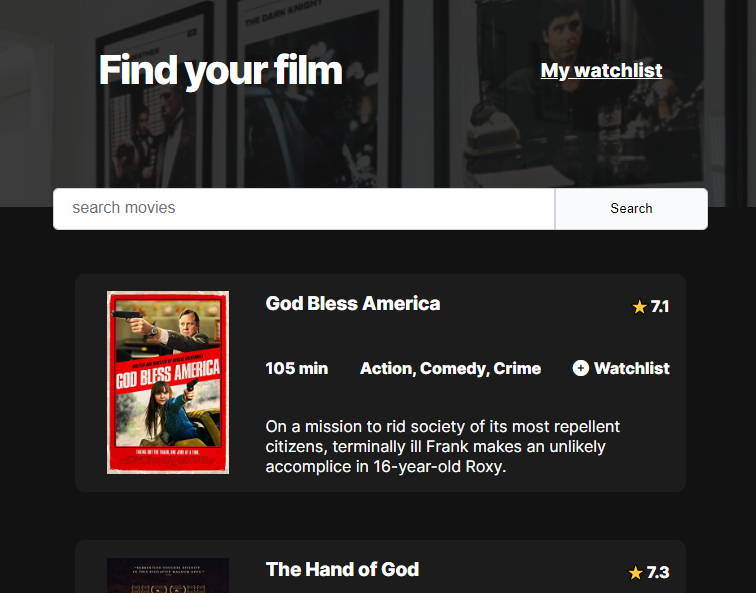

# Movie Watchlist

This is a Scrimba Challenge for a movie watchList App using the OMDb movie database API. The app takes a title input of a movie then returns the movies that match the search query. You have the ability to add the movies to a watchList page by storing the selecting movie in local storage then rendering it when the window is loaded.

This project is a solution to Moview Watchlist solo project on Scrimba.

## Goals

- Build from scratch.
- Used the https://www.omdbapi.com/ API.

## Build with:

- HTML
- CSS
- Javasript
- Visual studio code
- API

## Overview
### Screenshot

## Links
- [Solution](https://github.com/Dachi-Papashvili88/movie-watchlist)
- [Live](https://vermillion-tapioca-f840fd.netlify.app/)